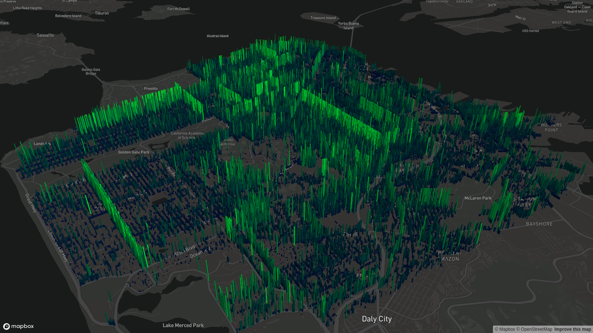
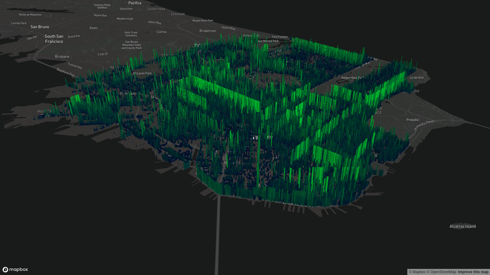

## D-map project

This map display DBH (Diameter at breast height) in San Francisco.

Diameter at breast height, or DBH, is a standard method of expressing the diameter of the trunk or bole of a standing tree. DBH is one of the most common dendrometric measurements.

